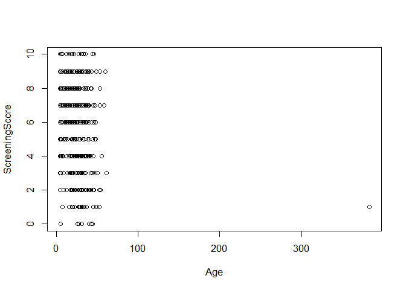
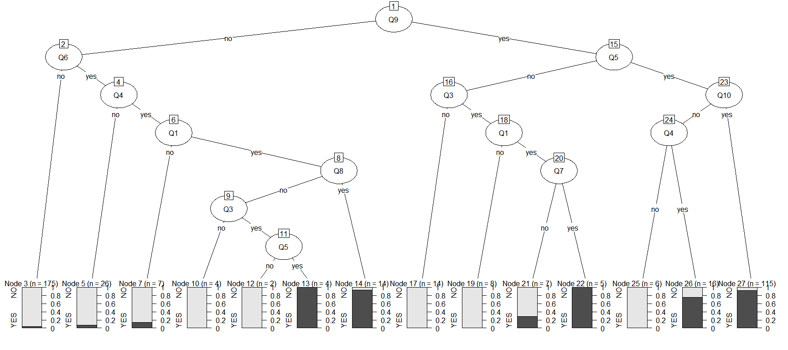
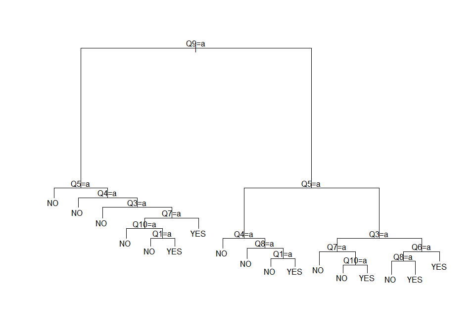

Influence of Gender on Autism Spectrum Disorder(ASD)
================
Nina Kumagai & Cheah Yanan

# Introduction: Problem Statement and Background

``` r
adolescent <- read.csv("Adolescent_Autism.csv")
adult <- read.csv("Adult_Autism.csv")
child <- read.csv("Child_Autism.csv")
```

``` r
autism <- rbind(adolescent,adult, child)
str(autism)
```

    ## 'data.frame':    1100 obs. of  21 variables:
    ##  $ Q1            : int  0 0 0 0 1 1 0 1 1 0 ...
    ##  $ Q2            : int  0 0 0 1 1 0 0 1 1 1 ...
    ##  $ Q3            : int  0 0 0 1 1 0 0 0 1 1 ...
    ##  $ Q4            : int  1 0 0 1 1 0 1 1 1 0 ...
    ##  $ Q5            : int  1 0 0 1 1 0 1 1 1 0 ...
    ##  $ Q6            : int  1 0 0 1 1 1 1 0 1 1 ...
    ##  $ Q7            : int  1 0 0 0 1 0 1 1 0 0 ...
    ##  $ Q8            : int  1 0 0 1 0 0 1 1 0 0 ...
    ##  $ Q9            : int  1 1 1 1 0 1 1 0 0 1 ...
    ##  $ Q10           : int  0 1 1 0 0 0 0 1 0 0 ...
    ##  $ Age           : chr  "15" "15" "12" "14" ...
    ##  $ Gender        : Factor w/ 2 levels "f","m": 2 2 1 1 1 1 1 1 2 1 ...
    ##  $ Race          : Factor w/ 12 levels "'Middle Eastern '",..: 6 5 3 9 3 3 3 1 5 2 ...
    ##  $ Jaundice      : Factor w/ 2 levels "no","yes": 2 1 1 1 1 1 1 1 2 1 ...
    ##  $ FamilyPDD     : Factor w/ 2 levels "no","yes": 2 1 1 1 1 1 1 1 2 1 ...
    ##  $ Residence     : Factor w/ 89 levels "'New Zealand'",..: 13 13 9 4 8 18 7 12 16 14 ...
    ##  $ SecondUse     : Factor w/ 2 levels "no","yes": 1 1 1 1 1 1 1 1 1 1 ...
    ##  $ ScreeningScore: int  6 2 2 7 7 3 6 7 6 4 ...
    ##  $ AgeRange      : Factor w/ 4 levels "'12-15 years'",..: 2 2 2 2 2 2 2 2 2 2 ...
    ##  $ Response      : Factor w/ 7 levels "'Health care professional'",..: 4 5 2 6 2 2 2 4 4 4 ...
    ##  $ ASD           : Factor w/ 2 levels "NO","YES": 1 1 1 2 2 1 1 2 1 1 ...

``` r
adolescent$lifeStage <- "Adolescent"
adult$lifeStage <- "Adult"
child$lifeStage <- "Child"

autism <- rbind(adolescent,adult, child)
str(autism)
```

    ## 'data.frame':    1100 obs. of  22 variables:
    ##  $ Q1            : int  0 0 0 0 1 1 0 1 1 0 ...
    ##  $ Q2            : int  0 0 0 1 1 0 0 1 1 1 ...
    ##  $ Q3            : int  0 0 0 1 1 0 0 0 1 1 ...
    ##  $ Q4            : int  1 0 0 1 1 0 1 1 1 0 ...
    ##  $ Q5            : int  1 0 0 1 1 0 1 1 1 0 ...
    ##  $ Q6            : int  1 0 0 1 1 1 1 0 1 1 ...
    ##  $ Q7            : int  1 0 0 0 1 0 1 1 0 0 ...
    ##  $ Q8            : int  1 0 0 1 0 0 1 1 0 0 ...
    ##  $ Q9            : int  1 1 1 1 0 1 1 0 0 1 ...
    ##  $ Q10           : int  0 1 1 0 0 0 0 1 0 0 ...
    ##  $ Age           : chr  "15" "15" "12" "14" ...
    ##  $ Gender        : Factor w/ 2 levels "f","m": 2 2 1 1 1 1 1 1 2 1 ...
    ##  $ Race          : Factor w/ 12 levels "'Middle Eastern '",..: 6 5 3 9 3 3 3 1 5 2 ...
    ##  $ Jaundice      : Factor w/ 2 levels "no","yes": 2 1 1 1 1 1 1 1 2 1 ...
    ##  $ FamilyPDD     : Factor w/ 2 levels "no","yes": 2 1 1 1 1 1 1 1 2 1 ...
    ##  $ Residence     : Factor w/ 89 levels "'New Zealand'",..: 13 13 9 4 8 18 7 12 16 14 ...
    ##  $ SecondUse     : Factor w/ 2 levels "no","yes": 1 1 1 1 1 1 1 1 1 1 ...
    ##  $ ScreeningScore: int  6 2 2 7 7 3 6 7 6 4 ...
    ##  $ AgeRange      : Factor w/ 4 levels "'12-15 years'",..: 2 2 2 2 2 2 2 2 2 2 ...
    ##  $ Response      : Factor w/ 7 levels "'Health care professional'",..: 4 5 2 6 2 2 2 4 4 4 ...
    ##  $ ASD           : Factor w/ 2 levels "NO","YES": 1 1 1 2 2 1 1 2 1 1 ...
    ##  $ lifeStage     : chr  "Adolescent" "Adolescent" "Adolescent" "Adolescent" ...

``` r
dim(autism)
```

    ## [1] 1100   22

``` r
colnames(autism)
```

    ##  [1] "Q1"             "Q2"             "Q3"             "Q4"            
    ##  [5] "Q5"             "Q6"             "Q7"             "Q8"            
    ##  [9] "Q9"             "Q10"            "Age"            "Gender"        
    ## [13] "Race"           "Jaundice"       "FamilyPDD"      "Residence"     
    ## [17] "SecondUse"      "ScreeningScore" "AgeRange"       "Response"      
    ## [21] "ASD"            "lifeStage"

``` r
summary(autism)
```

    ##        Q1               Q2               Q3               Q4      
    ##  Min.   :0.0000   Min.   :0.0000   Min.   :0.0000   Min.   :0.00  
    ##  1st Qu.:0.0000   1st Qu.:0.0000   1st Qu.:0.0000   1st Qu.:0.00  
    ##  Median :1.0000   Median :0.0000   Median :1.0000   Median :1.00  
    ##  Mean   :0.6991   Mean   :0.4827   Mean   :0.5518   Mean   :0.53  
    ##  3rd Qu.:1.0000   3rd Qu.:1.0000   3rd Qu.:1.0000   3rd Qu.:1.00  
    ##  Max.   :1.0000   Max.   :1.0000   Max.   :1.0000   Max.   :1.00  
    ##                                                                   
    ##        Q5               Q6               Q7               Q8        
    ##  Min.   :0.0000   Min.   :0.0000   Min.   :0.0000   Min.   :0.0000  
    ##  1st Qu.:0.0000   1st Qu.:0.0000   1st Qu.:0.0000   1st Qu.:0.0000  
    ##  Median :1.0000   Median :0.0000   Median :0.0000   Median :1.0000  
    ##  Mean   :0.5873   Mean   :0.4436   Mean   :0.4773   Mean   :0.6055  
    ##  3rd Qu.:1.0000   3rd Qu.:1.0000   3rd Qu.:1.0000   3rd Qu.:1.0000  
    ##  Max.   :1.0000   Max.   :1.0000   Max.   :1.0000   Max.   :1.0000  
    ##                                                                     
    ##        Q9              Q10             Age            Gender 
    ##  Min.   :0.0000   Min.   :0.0000   Length:1100        f:475  
    ##  1st Qu.:0.0000   1st Qu.:0.0000   Class :character   m:625  
    ##  Median :0.0000   Median :1.0000   Mode  :character          
    ##  Mean   :0.4127   Mean   :0.6218                             
    ##  3rd Qu.:1.0000   3rd Qu.:1.0000                             
    ##  Max.   :1.0000   Max.   :1.0000                             
    ##                                                              
    ##                 Race     Jaundice  FamilyPDD                  Residence  
    ##  White-European   :381   no :935   no :946   'United States'       :167  
    ##  Asian            :185   yes:165   yes:154   'United Kingdom'      :155  
    ##  ?                :144                       India                 :130  
    ##  'Middle Eastern ':128                       'New Zealand'         : 95  
    ##  Black            : 65                       'United Arab Emirates': 90  
    ##  'South Asian'    : 60                       Jordan                : 68  
    ##  (Other)          :137                       (Other)               :395  
    ##  SecondUse  ScreeningScore            AgeRange  
    ##  no :1073   Min.   : 0.000   '12-15 years':  7  
    ##  yes:  27   1st Qu.: 3.000   '12-16 years': 97  
    ##             Median : 5.000   '18 and more':704  
    ##             Mean   : 5.412   '4-11 years' :292  
    ##             3rd Qu.: 7.250                      
    ##             Max.   :10.000                      
    ##                                                 
    ##                        Response    ASD       lifeStage        
    ##  'Health care professional': 23   NO :707   Length:1100       
    ##  ?                         :144   YES:393   Class :character  
    ##  Others                    :  8             Mode  :character  
    ##  Parent                    :300                               
    ##  Relative                  : 53                               
    ##  Self                      :571                               
    ##  self                      :  1

``` r
autism$Q1[autism$Q1==0] <- "no"
autism$Q1[autism$Q1==1] <- "yes"
autism$Q2[autism$Q2==0] <- "no"
autism$Q2[autism$Q2==1] <- "yes"
autism$Q3[autism$Q3==0] <- "no"
autism$Q3[autism$Q3==1] <- "yes"
autism$Q4[autism$Q4==0] <- "no"
autism$Q4[autism$Q4==1] <- "yes"
autism$Q5[autism$Q5==0] <- "no"
autism$Q5[autism$Q5==1] <- "yes"
autism$Q6[autism$Q6==0] <- "no"
autism$Q6[autism$Q6==1] <- "yes"
autism$Q7[autism$Q7==0] <- "no"
autism$Q7[autism$Q7==1] <- "yes"
autism$Q8[autism$Q8==0] <- "no"
autism$Q8[autism$Q8==1] <- "yes"
autism$Q9[autism$Q9==0] <- "no"
autism$Q9[autism$Q9==1] <- "yes"
autism$Q10[autism$Q10==0] <- "no"
autism$Q10[autism$Q10==1] <- "yes"
```

``` r
autism$Q1 <- as.factor(autism$Q1)
autism$Q2 <- as.factor(autism$Q2)
autism$Q3 <- as.factor(autism$Q3)
autism$Q4 <- as.factor(autism$Q4)
autism$Q5 <- as.factor(autism$Q5)
autism$Q6 <- as.factor(autism$Q6)
autism$Q7 <- as.factor(autism$Q7)
autism$Q8 <- as.factor(autism$Q8)
autism$Q9 <- as.factor(autism$Q9)
autism$Q10 <- as.factor(autism$Q10)
```

``` r
female <- subset(autism, subset = Gender=="f")
male <- subset(autism, subset = Gender =="m")
```

``` r
library(Hmisc)
```

    ## Loading required package: lattice

    ## Loading required package: survival

    ## Loading required package: Formula

    ## Loading required package: ggplot2

    ## 
    ## Attaching package: 'Hmisc'

    ## The following objects are masked from 'package:base':
    ## 
    ##     format.pval, units

``` r
describe(female)
```

    ## female 
    ## 
    ##  22  Variables      475  Observations
    ## ---------------------------------------------------------------------------
    ## Q1 
    ##        n  missing distinct 
    ##      475        0        2 
    ##                       
    ## Value         no   yes
    ## Frequency    122   353
    ## Proportion 0.257 0.743
    ## ---------------------------------------------------------------------------
    ## Q2 
    ##        n  missing distinct 
    ##      475        0        2 
    ##                       
    ## Value         no   yes
    ## Frequency    242   233
    ## Proportion 0.509 0.491
    ## ---------------------------------------------------------------------------
    ## Q3 
    ##        n  missing distinct 
    ##      475        0        2 
    ##                       
    ## Value         no   yes
    ## Frequency    227   248
    ## Proportion 0.478 0.522
    ## ---------------------------------------------------------------------------
    ## Q4 
    ##        n  missing distinct 
    ##      475        0        2 
    ##                       
    ## Value         no   yes
    ## Frequency    213   262
    ## Proportion 0.448 0.552
    ## ---------------------------------------------------------------------------
    ## Q5 
    ##        n  missing distinct 
    ##      475        0        2 
    ##                       
    ## Value         no   yes
    ## Frequency    199   276
    ## Proportion 0.419 0.581
    ## ---------------------------------------------------------------------------
    ## Q6 
    ##        n  missing distinct 
    ##      475        0        2 
    ##                     
    ## Value        no  yes
    ## Frequency   266  209
    ## Proportion 0.56 0.44
    ## ---------------------------------------------------------------------------
    ## Q7 
    ##        n  missing distinct 
    ##      475        0        2 
    ##                       
    ## Value         no   yes
    ## Frequency    272   203
    ## Proportion 0.573 0.427
    ## ---------------------------------------------------------------------------
    ## Q8 
    ##        n  missing distinct 
    ##      475        0        2 
    ##                       
    ## Value         no   yes
    ## Frequency    198   277
    ## Proportion 0.417 0.583
    ## ---------------------------------------------------------------------------
    ## Q9 
    ##        n  missing distinct 
    ##      475        0        2 
    ##                       
    ## Value         no   yes
    ## Frequency    275   200
    ## Proportion 0.579 0.421
    ## ---------------------------------------------------------------------------
    ## Q10 
    ##        n  missing distinct 
    ##      475        0        2 
    ##                       
    ## Value         no   yes
    ## Frequency    174   301
    ## Proportion 0.366 0.634
    ## ---------------------------------------------------------------------------
    ## Age 
    ##        n  missing distinct 
    ##      475        0       55 
    ## 
    ## lowest : ?  10 11 12 13, highest: 60 61 7  8  9 
    ## ---------------------------------------------------------------------------
    ## Gender 
    ##        n  missing distinct    value 
    ##      475        0        1        f 
    ##               
    ## Value        f
    ## Frequency  475
    ## Proportion   1
    ## ---------------------------------------------------------------------------
    ## Race 
    ##        n  missing distinct 
    ##      475        0       11 
    ## 
    ## 'Middle Eastern ' (54, 0.114), 'South Asian' (26, 0.055), ? (64, 0.135),
    ## Asian (61, 0.128), Black (32, 0.067), Hispanic (5, 0.011), Latino (12,
    ## 0.025), Others (28, 0.059), White-European (185, 0.389), Pasifika (6,
    ## 0.013), Turkish (2, 0.004)
    ## ---------------------------------------------------------------------------
    ## Jaundice 
    ##        n  missing distinct 
    ##      475        0        2 
    ##                       
    ## Value         no   yes
    ## Frequency    408    67
    ## Proportion 0.859 0.141
    ## ---------------------------------------------------------------------------
    ## FamilyPDD 
    ##        n  missing distinct 
    ##      475        0        2 
    ##                       
    ## Value         no   yes
    ## Frequency    394    81
    ## Proportion 0.829 0.171
    ## ---------------------------------------------------------------------------
    ## Residence 
    ##        n  missing distinct 
    ##      475        0       60 
    ## 
    ## lowest : 'New Zealand'          'South Africa'         'United Arab Emirates' 'United Kingdom'       'United States'       
    ## highest: Bhutan                 Georgia                Kuwait                 Nigeria                Syria                 
    ## ---------------------------------------------------------------------------
    ## SecondUse 
    ##        n  missing distinct 
    ##      475        0        2 
    ##                       
    ## Value         no   yes
    ## Frequency    466     9
    ## Proportion 0.981 0.019
    ## ---------------------------------------------------------------------------
    ## ScreeningScore 
    ##        n  missing distinct     Info     Mean      Gmd      .05      .10 
    ##      475        0       11    0.987    5.394    2.923      1.7      2.0 
    ##      .25      .50      .75      .90      .95 
    ##      3.0      5.0      8.0      9.0      9.0 
    ##                                                                       
    ## Value          0     1     2     3     4     5     6     7     8     9
    ## Frequency      8    16    46    51    80    48    49    55    57    44
    ## Proportion 0.017 0.034 0.097 0.107 0.168 0.101 0.103 0.116 0.120 0.093
    ##                 
    ## Value         10
    ## Frequency     21
    ## Proportion 0.044
    ## ---------------------------------------------------------------------------
    ## AgeRange 
    ##        n  missing distinct 
    ##      475        0        4 
    ##                                                                   
    ## Value      '12-15 years' '12-16 years' '18 and more'  '4-11 years'
    ## Frequency              5            49           337            84
    ## Proportion         0.011         0.103         0.709         0.177
    ## ---------------------------------------------------------------------------
    ## Response 
    ##        n  missing distinct 
    ##      475        0        5 
    ## 
    ## 'Health care professional' (10, 0.021), ? (64, 0.135), Parent (105,
    ## 0.221), Relative (12, 0.025), Self (284, 0.598)
    ## ---------------------------------------------------------------------------
    ## ASD 
    ##        n  missing distinct 
    ##      475        0        2 
    ##                       
    ## Value         NO   YES
    ## Frequency    298   177
    ## Proportion 0.627 0.373
    ## ---------------------------------------------------------------------------
    ## lifeStage 
    ##        n  missing distinct 
    ##      475        0        3 
    ##                                            
    ## Value      Adolescent      Adult      Child
    ## Frequency          54        337         84
    ## Proportion      0.114      0.709      0.177
    ## ---------------------------------------------------------------------------

``` r
describe(male)
```

    ## male 
    ## 
    ##  22  Variables      625  Observations
    ## ---------------------------------------------------------------------------
    ## Q1 
    ##        n  missing distinct 
    ##      625        0        2 
    ##                       
    ## Value         no   yes
    ## Frequency    209   416
    ## Proportion 0.334 0.666
    ## ---------------------------------------------------------------------------
    ## Q2 
    ##        n  missing distinct 
    ##      625        0        2 
    ##                       
    ## Value         no   yes
    ## Frequency    327   298
    ## Proportion 0.523 0.477
    ## ---------------------------------------------------------------------------
    ## Q3 
    ##        n  missing distinct 
    ##      625        0        2 
    ##                       
    ## Value         no   yes
    ## Frequency    266   359
    ## Proportion 0.426 0.574
    ## ---------------------------------------------------------------------------
    ## Q4 
    ##        n  missing distinct 
    ##      625        0        2 
    ##                       
    ## Value         no   yes
    ## Frequency    304   321
    ## Proportion 0.486 0.514
    ## ---------------------------------------------------------------------------
    ## Q5 
    ##        n  missing distinct 
    ##      625        0        2 
    ##                       
    ## Value         no   yes
    ## Frequency    255   370
    ## Proportion 0.408 0.592
    ## ---------------------------------------------------------------------------
    ## Q6 
    ##        n  missing distinct 
    ##      625        0        2 
    ##                       
    ## Value         no   yes
    ## Frequency    346   279
    ## Proportion 0.554 0.446
    ## ---------------------------------------------------------------------------
    ## Q7 
    ##        n  missing distinct 
    ##      625        0        2 
    ##                       
    ## Value         no   yes
    ## Frequency    303   322
    ## Proportion 0.485 0.515
    ## ---------------------------------------------------------------------------
    ## Q8 
    ##        n  missing distinct 
    ##      625        0        2 
    ##                       
    ## Value         no   yes
    ## Frequency    236   389
    ## Proportion 0.378 0.622
    ## ---------------------------------------------------------------------------
    ## Q9 
    ##        n  missing distinct 
    ##      625        0        2 
    ##                       
    ## Value         no   yes
    ## Frequency    371   254
    ## Proportion 0.594 0.406
    ## ---------------------------------------------------------------------------
    ## Q10 
    ##        n  missing distinct 
    ##      625        0        2 
    ##                       
    ## Value         no   yes
    ## Frequency    242   383
    ## Proportion 0.387 0.613
    ## ---------------------------------------------------------------------------
    ## Age 
    ##        n  missing distinct 
    ##      625        0       57 
    ## 
    ## lowest : ?  10 11 12 13, highest: 61 64 7  8  9 
    ## ---------------------------------------------------------------------------
    ## Gender 
    ##        n  missing distinct    value 
    ##      625        0        1        m 
    ##               
    ## Value        m
    ## Frequency  625
    ## Proportion   1
    ## ---------------------------------------------------------------------------
    ## Race 
    ##        n  missing distinct 
    ##      625        0       12 
    ## 
    ## 'Middle Eastern ' (74, 0.118), 'South Asian' (34, 0.054), ? (80, 0.128),
    ## Asian (124, 0.198), Black (33, 0.053), Hispanic (20, 0.032), Latino (21,
    ## 0.034), Others (28, 0.045), White-European (196, 0.314), others (1,
    ## 0.002), Pasifika (8, 0.013), Turkish (6, 0.010)
    ## ---------------------------------------------------------------------------
    ## Jaundice 
    ##        n  missing distinct 
    ##      625        0        2 
    ##                       
    ## Value         no   yes
    ## Frequency    527    98
    ## Proportion 0.843 0.157
    ## ---------------------------------------------------------------------------
    ## FamilyPDD 
    ##        n  missing distinct 
    ##      625        0        2 
    ##                       
    ## Value         no   yes
    ## Frequency    552    73
    ## Proportion 0.883 0.117
    ## ---------------------------------------------------------------------------
    ## Residence 
    ##        n  missing distinct 
    ##      625        0       73 
    ## 
    ## lowest : 'New Zealand'          'South Africa'         'United Arab Emirates' 'United Kingdom'       'United States'       
    ## highest: Latvia                 Libya                  Malta                  Qatar                  Syria                 
    ## ---------------------------------------------------------------------------
    ## SecondUse 
    ##        n  missing distinct 
    ##      625        0        2 
    ##                       
    ## Value         no   yes
    ## Frequency    607    18
    ## Proportion 0.971 0.029
    ## ---------------------------------------------------------------------------
    ## ScreeningScore 
    ##        n  missing distinct     Info     Mean      Gmd      .05      .10 
    ##      625        0       11    0.987    5.426    2.858        1        2 
    ##      .25      .50      .75      .90      .95 
    ##        3        5        7        9       10 
    ##                                                                       
    ## Value          0     1     2     3     4     5     6     7     8     9
    ## Frequency      7    26    39    85    94    81    77    63    64    54
    ## Proportion 0.011 0.042 0.062 0.136 0.150 0.130 0.123 0.101 0.102 0.086
    ##                 
    ## Value         10
    ## Frequency     35
    ## Proportion 0.056
    ## ---------------------------------------------------------------------------
    ## AgeRange 
    ##        n  missing distinct 
    ##      625        0        4 
    ##                                                                   
    ## Value      '12-15 years' '12-16 years' '18 and more'  '4-11 years'
    ## Frequency              2            48           367           208
    ## Proportion         0.003         0.077         0.587         0.333
    ## ---------------------------------------------------------------------------
    ## Response 
    ##        n  missing distinct 
    ##      625        0        7 
    ## 
    ## 'Health care professional' (13, 0.021), ? (80, 0.128), Others (8, 0.013),
    ## Parent (195, 0.312), Relative (41, 0.066), Self (287, 0.459), self (1,
    ## 0.002)
    ## ---------------------------------------------------------------------------
    ## ASD 
    ##        n  missing distinct 
    ##      625        0        2 
    ##                       
    ## Value         NO   YES
    ## Frequency    409   216
    ## Proportion 0.654 0.346
    ## ---------------------------------------------------------------------------
    ## lifeStage 
    ##        n  missing distinct 
    ##      625        0        3 
    ##                                            
    ## Value      Adolescent      Adult      Child
    ## Frequency          50        367        208
    ## Proportion      0.080      0.587      0.333
    ## ---------------------------------------------------------------------------

``` r
rownames(male) <- 1:nrow(male)
```

``` r
rownames(female) <- 1:nrow(female)
```

``` r
male <- male[-52:-79, ]
```

``` r
male <- male[-419:-542, ]
```

``` r
describe(male)
```

    ## male 
    ## 
    ##  22  Variables      473  Observations
    ## ---------------------------------------------------------------------------
    ## Q1 
    ##        n  missing distinct 
    ##      473        0        2 
    ##                       
    ## Value         no   yes
    ## Frequency    144   329
    ## Proportion 0.304 0.696
    ## ---------------------------------------------------------------------------
    ## Q2 
    ##        n  missing distinct 
    ##      473        0        2 
    ##                       
    ## Value         no   yes
    ## Frequency    249   224
    ## Proportion 0.526 0.474
    ## ---------------------------------------------------------------------------
    ## Q3 
    ##        n  missing distinct 
    ##      473        0        2 
    ##                       
    ## Value         no   yes
    ## Frequency    223   250
    ## Proportion 0.471 0.529
    ## ---------------------------------------------------------------------------
    ## Q4 
    ##        n  missing distinct 
    ##      473        0        2 
    ##                       
    ## Value         no   yes
    ## Frequency    235   238
    ## Proportion 0.497 0.503
    ## ---------------------------------------------------------------------------
    ## Q5 
    ##        n  missing distinct 
    ##      473        0        2 
    ##                       
    ## Value         no   yes
    ## Frequency    210   263
    ## Proportion 0.444 0.556
    ## ---------------------------------------------------------------------------
    ## Q6 
    ##        n  missing distinct 
    ##      473        0        2 
    ##                       
    ## Value         no   yes
    ## Frequency    289   184
    ## Proportion 0.611 0.389
    ## ---------------------------------------------------------------------------
    ## Q7 
    ##        n  missing distinct 
    ##      473        0        2 
    ##                       
    ## Value         no   yes
    ## Frequency    235   238
    ## Proportion 0.497 0.503
    ## ---------------------------------------------------------------------------
    ## Q8 
    ##        n  missing distinct 
    ##      473        0        2 
    ##                       
    ## Value         no   yes
    ## Frequency    169   304
    ## Proportion 0.357 0.643
    ## ---------------------------------------------------------------------------
    ## Q9 
    ##        n  missing distinct 
    ##      473        0        2 
    ##                       
    ## Value         no   yes
    ## Frequency    292   181
    ## Proportion 0.617 0.383
    ## ---------------------------------------------------------------------------
    ## Q10 
    ##        n  missing distinct 
    ##      473        0        2 
    ##                       
    ## Value         no   yes
    ## Frequency    198   275
    ## Proportion 0.419 0.581
    ## ---------------------------------------------------------------------------
    ## Age 
    ##        n  missing distinct 
    ##      473        0       56 
    ## 
    ## lowest : ?  10 11 12 13, highest: 6  61 7  8  9 
    ## ---------------------------------------------------------------------------
    ## Gender 
    ##        n  missing distinct    value 
    ##      473        0        1        m 
    ##               
    ## Value        m
    ## Frequency  473
    ## Proportion   1
    ## ---------------------------------------------------------------------------
    ## Race 
    ##        n  missing distinct 
    ##      473        0       12 
    ## 
    ## 'Middle Eastern ' (61, 0.129), 'South Asian' (27, 0.057), ? (58, 0.123),
    ## Asian (98, 0.207), Black (27, 0.057), Hispanic (15, 0.032), Latino (14,
    ## 0.030), Others (24, 0.051), White-European (139, 0.294), others (1,
    ## 0.002), Pasifika (5, 0.011), Turkish (4, 0.008)
    ## ---------------------------------------------------------------------------
    ## Jaundice 
    ##        n  missing distinct 
    ##      473        0        2 
    ##                     
    ## Value        no  yes
    ## Frequency   407   66
    ## Proportion 0.86 0.14
    ## ---------------------------------------------------------------------------
    ## FamilyPDD 
    ##        n  missing distinct 
    ##      473        0        2 
    ##                       
    ## Value         no   yes
    ## Frequency    427    46
    ## Proportion 0.903 0.097
    ## ---------------------------------------------------------------------------
    ## Residence 
    ##        n  missing distinct 
    ##      473        0       61 
    ## 
    ## lowest : 'New Zealand'          'South Africa'         'United Arab Emirates' 'United Kingdom'       'United States'       
    ## highest: Bulgaria               Europe                 Ghana                  Libya                  Malta                 
    ## ---------------------------------------------------------------------------
    ## SecondUse 
    ##        n  missing distinct 
    ##      473        0        2 
    ##                       
    ## Value         no   yes
    ## Frequency    462    11
    ## Proportion 0.977 0.023
    ## ---------------------------------------------------------------------------
    ## ScreeningScore 
    ##        n  missing distinct     Info     Mean      Gmd      .05      .10 
    ##      473        0       11    0.985    5.256    2.821      1.6      2.0 
    ##      .25      .50      .75      .90      .95 
    ##      3.0      5.0      7.0      9.0     10.0 
    ##                                                                       
    ## Value          0     1     2     3     4     5     6     7     8     9
    ## Frequency      5    19    32    75    76    63    56    40    45    37
    ## Proportion 0.011 0.040 0.068 0.159 0.161 0.133 0.118 0.085 0.095 0.078
    ##                 
    ## Value         10
    ## Frequency     25
    ## Proportion 0.053
    ## ---------------------------------------------------------------------------
    ## AgeRange 
    ##        n  missing distinct 
    ##      473        0        4 
    ##                                                                   
    ## Value      '12-15 years' '12-16 years' '18 and more'  '4-11 years'
    ## Frequency              2            48           339            84
    ## Proportion         0.004         0.101         0.717         0.178
    ## ---------------------------------------------------------------------------
    ## Response 
    ##        n  missing distinct 
    ##      473        0        6 
    ## 
    ## 'Health care professional' (9, 0.019), ? (58, 0.123), Others (8, 0.017),
    ## Parent (97, 0.205), Relative (27, 0.057), Self (274, 0.579)
    ## ---------------------------------------------------------------------------
    ## ASD 
    ##        n  missing distinct 
    ##      473        0        2 
    ##                       
    ## Value         NO   YES
    ## Frequency    326   147
    ## Proportion 0.689 0.311
    ## ---------------------------------------------------------------------------
    ## lifeStage 
    ##        n  missing distinct 
    ##      473        0        3 
    ##                                            
    ## Value      Adolescent      Adult      Child
    ## Frequency          50        339         84
    ## Proportion      0.106      0.717      0.178
    ## ---------------------------------------------------------------------------

``` r
dim(male)
```

    ## [1] 473  22

``` r
autism <- rbind(male, female) 
```

``` r
str(autism)
```

    ## 'data.frame':    948 obs. of  22 variables:
    ##  $ Q1            : Factor w/ 2 levels "no","yes": 1 1 2 2 2 2 2 2 2 1 ...
    ##  $ Q2            : Factor w/ 2 levels "no","yes": 1 1 2 2 2 1 2 2 2 2 ...
    ##  $ Q3            : Factor w/ 2 levels "no","yes": 1 1 2 2 2 2 2 1 1 2 ...
    ##  $ Q4            : Factor w/ 2 levels "no","yes": 2 1 2 1 2 2 2 2 1 2 ...
    ##  $ Q5            : Factor w/ 2 levels "no","yes": 2 1 2 2 1 2 2 1 1 2 ...
    ##  $ Q6            : Factor w/ 2 levels "no","yes": 2 1 2 2 2 2 2 1 1 2 ...
    ##  $ Q7            : Factor w/ 2 levels "no","yes": 2 1 1 2 2 2 2 1 2 2 ...
    ##  $ Q8            : Factor w/ 2 levels "no","yes": 2 1 1 1 2 2 2 1 1 2 ...
    ##  $ Q9            : Factor w/ 2 levels "no","yes": 2 2 1 2 2 2 2 1 2 2 ...
    ##  $ Q10           : Factor w/ 2 levels "no","yes": 1 2 1 2 2 2 2 1 1 2 ...
    ##  $ Age           : chr  "15" "15" "12" "12" ...
    ##  $ Gender        : Factor w/ 2 levels "f","m": 2 2 2 2 2 2 2 2 2 2 ...
    ##  $ Race          : Factor w/ 12 levels "'Middle Eastern '",..: 6 5 5 9 9 1 6 1 3 8 ...
    ##  $ Jaundice      : Factor w/ 2 levels "no","yes": 2 1 2 1 1 1 1 1 1 1 ...
    ##  $ FamilyPDD     : Factor w/ 2 levels "no","yes": 2 1 2 1 1 2 1 1 1 1 ...
    ##  $ Residence     : Factor w/ 89 levels "'New Zealand'",..: 13 13 16 4 1 5 11 30 7 4 ...
    ##  $ SecondUse     : Factor w/ 2 levels "no","yes": 1 1 1 1 1 1 1 1 1 1 ...
    ##  $ ScreeningScore: int  6 2 6 8 9 9 10 3 4 9 ...
    ##  $ AgeRange      : Factor w/ 4 levels "'12-15 years'",..: 2 2 2 2 2 2 2 2 2 2 ...
    ##  $ Response      : Factor w/ 7 levels "'Health care professional'",..: 4 5 4 4 4 4 6 6 2 4 ...
    ##  $ ASD           : Factor w/ 2 levels "NO","YES": 1 1 1 2 2 2 2 1 1 2 ...
    ##  $ lifeStage     : chr  "Adolescent" "Adolescent" "Adolescent" "Adolescent" ...

``` r
library(Hmisc)
des <- describe(autism)
des
```

    ## autism 
    ## 
    ##  22  Variables      948  Observations
    ## ---------------------------------------------------------------------------
    ## Q1 
    ##        n  missing distinct 
    ##      948        0        2 
    ##                       
    ## Value         no   yes
    ## Frequency    266   682
    ## Proportion 0.281 0.719
    ## ---------------------------------------------------------------------------
    ## Q2 
    ##        n  missing distinct 
    ##      948        0        2 
    ##                       
    ## Value         no   yes
    ## Frequency    491   457
    ## Proportion 0.518 0.482
    ## ---------------------------------------------------------------------------
    ## Q3 
    ##        n  missing distinct 
    ##      948        0        2 
    ##                       
    ## Value         no   yes
    ## Frequency    450   498
    ## Proportion 0.475 0.525
    ## ---------------------------------------------------------------------------
    ## Q4 
    ##        n  missing distinct 
    ##      948        0        2 
    ##                       
    ## Value         no   yes
    ## Frequency    448   500
    ## Proportion 0.473 0.527
    ## ---------------------------------------------------------------------------
    ## Q5 
    ##        n  missing distinct 
    ##      948        0        2 
    ##                       
    ## Value         no   yes
    ## Frequency    409   539
    ## Proportion 0.431 0.569
    ## ---------------------------------------------------------------------------
    ## Q6 
    ##        n  missing distinct 
    ##      948        0        2 
    ##                       
    ## Value         no   yes
    ## Frequency    555   393
    ## Proportion 0.585 0.415
    ## ---------------------------------------------------------------------------
    ## Q7 
    ##        n  missing distinct 
    ##      948        0        2 
    ##                       
    ## Value         no   yes
    ## Frequency    507   441
    ## Proportion 0.535 0.465
    ## ---------------------------------------------------------------------------
    ## Q8 
    ##        n  missing distinct 
    ##      948        0        2 
    ##                       
    ## Value         no   yes
    ## Frequency    367   581
    ## Proportion 0.387 0.613
    ## ---------------------------------------------------------------------------
    ## Q9 
    ##        n  missing distinct 
    ##      948        0        2 
    ##                       
    ## Value         no   yes
    ## Frequency    567   381
    ## Proportion 0.598 0.402
    ## ---------------------------------------------------------------------------
    ## Q10 
    ##        n  missing distinct 
    ##      948        0        2 
    ##                       
    ## Value         no   yes
    ## Frequency    372   576
    ## Proportion 0.392 0.608
    ## ---------------------------------------------------------------------------
    ## Age 
    ##        n  missing distinct 
    ##      948        0       59 
    ## 
    ## lowest : ?  10 11 12 13, highest: 60 61 7  8  9 
    ## ---------------------------------------------------------------------------
    ## Gender 
    ##        n  missing distinct 
    ##      948        0        2 
    ##                       
    ## Value          f     m
    ## Frequency    475   473
    ## Proportion 0.501 0.499
    ## ---------------------------------------------------------------------------
    ## Race 
    ##        n  missing distinct 
    ##      948        0       12 
    ## 
    ## 'Middle Eastern ' (115, 0.121), 'South Asian' (53, 0.056), ? (122, 0.129),
    ## Asian (159, 0.168), Black (59, 0.062), Hispanic (20, 0.021), Latino (26,
    ## 0.027), Others (52, 0.055), White-European (324, 0.342), others (1,
    ## 0.001), Pasifika (11, 0.012), Turkish (6, 0.006)
    ## ---------------------------------------------------------------------------
    ## Jaundice 
    ##        n  missing distinct 
    ##      948        0        2 
    ##                     
    ## Value        no  yes
    ## Frequency   815  133
    ## Proportion 0.86 0.14
    ## ---------------------------------------------------------------------------
    ## FamilyPDD 
    ##        n  missing distinct 
    ##      948        0        2 
    ##                       
    ## Value         no   yes
    ## Frequency    821   127
    ## Proportion 0.866 0.134
    ## ---------------------------------------------------------------------------
    ## Residence 
    ##        n  missing distinct 
    ##      948        0       84 
    ## 
    ## lowest : 'New Zealand'          'South Africa'         'United Arab Emirates' 'United Kingdom'       'United States'       
    ## highest: Kuwait                 Libya                  Malta                  Nigeria                Syria                 
    ## ---------------------------------------------------------------------------
    ## SecondUse 
    ##        n  missing distinct 
    ##      948        0        2 
    ##                       
    ## Value         no   yes
    ## Frequency    928    20
    ## Proportion 0.979 0.021
    ## ---------------------------------------------------------------------------
    ## ScreeningScore 
    ##        n  missing distinct     Info     Mean      Gmd      .05      .10 
    ##      948        0       11    0.987    5.325    2.874     1.35     2.00 
    ##      .25      .50      .75      .90      .95 
    ##     3.00     5.00     7.00     9.00     9.00 
    ##                                                                       
    ## Value          0     1     2     3     4     5     6     7     8     9
    ## Frequency     13    35    78   126   156   111   105    95   102    81
    ## Proportion 0.014 0.037 0.082 0.133 0.165 0.117 0.111 0.100 0.108 0.085
    ##                 
    ## Value         10
    ## Frequency     46
    ## Proportion 0.049
    ## ---------------------------------------------------------------------------
    ## AgeRange 
    ##        n  missing distinct 
    ##      948        0        4 
    ##                                                                   
    ## Value      '12-15 years' '12-16 years' '18 and more'  '4-11 years'
    ## Frequency              7            97           676           168
    ## Proportion         0.007         0.102         0.713         0.177
    ## ---------------------------------------------------------------------------
    ## Response 
    ##        n  missing distinct 
    ##      948        0        6 
    ## 
    ## 'Health care professional' (19, 0.020), ? (122, 0.129), Others (8, 0.008),
    ## Parent (202, 0.213), Relative (39, 0.041), Self (558, 0.589)
    ## ---------------------------------------------------------------------------
    ## ASD 
    ##        n  missing distinct 
    ##      948        0        2 
    ##                       
    ## Value         NO   YES
    ## Frequency    624   324
    ## Proportion 0.658 0.342
    ## ---------------------------------------------------------------------------
    ## lifeStage 
    ##        n  missing distinct 
    ##      948        0        3 
    ##                                            
    ## Value      Adolescent      Adult      Child
    ## Frequency         104        676        168
    ## Proportion      0.110      0.713      0.177
    ## ---------------------------------------------------------------------------

``` r
plot(des)
```

    ## $Categorical

<!-- -->

    ## 
    ## $Continuous

<!-- -->

``` r
autism$Gender <- as.character(autism$Gender)
class(autism$Gender)
```

    ## [1] "character"

``` r
str(autism)
```

    ## 'data.frame':    948 obs. of  22 variables:
    ##  $ Q1            : Factor w/ 2 levels "no","yes": 1 1 2 2 2 2 2 2 2 1 ...
    ##  $ Q2            : Factor w/ 2 levels "no","yes": 1 1 2 2 2 1 2 2 2 2 ...
    ##  $ Q3            : Factor w/ 2 levels "no","yes": 1 1 2 2 2 2 2 1 1 2 ...
    ##  $ Q4            : Factor w/ 2 levels "no","yes": 2 1 2 1 2 2 2 2 1 2 ...
    ##  $ Q5            : Factor w/ 2 levels "no","yes": 2 1 2 2 1 2 2 1 1 2 ...
    ##  $ Q6            : Factor w/ 2 levels "no","yes": 2 1 2 2 2 2 2 1 1 2 ...
    ##  $ Q7            : Factor w/ 2 levels "no","yes": 2 1 1 2 2 2 2 1 2 2 ...
    ##  $ Q8            : Factor w/ 2 levels "no","yes": 2 1 1 1 2 2 2 1 1 2 ...
    ##  $ Q9            : Factor w/ 2 levels "no","yes": 2 2 1 2 2 2 2 1 2 2 ...
    ##  $ Q10           : Factor w/ 2 levels "no","yes": 1 2 1 2 2 2 2 1 1 2 ...
    ##  $ Age           : chr  "15" "15" "12" "12" ...
    ##  $ Gender        : chr  "m" "m" "m" "m" ...
    ##  $ Race          : Factor w/ 12 levels "'Middle Eastern '",..: 6 5 5 9 9 1 6 1 3 8 ...
    ##  $ Jaundice      : Factor w/ 2 levels "no","yes": 2 1 2 1 1 1 1 1 1 1 ...
    ##  $ FamilyPDD     : Factor w/ 2 levels "no","yes": 2 1 2 1 1 2 1 1 1 1 ...
    ##  $ Residence     : Factor w/ 89 levels "'New Zealand'",..: 13 13 16 4 1 5 11 30 7 4 ...
    ##  $ SecondUse     : Factor w/ 2 levels "no","yes": 1 1 1 1 1 1 1 1 1 1 ...
    ##  $ ScreeningScore: int  6 2 6 8 9 9 10 3 4 9 ...
    ##  $ AgeRange      : Factor w/ 4 levels "'12-15 years'",..: 2 2 2 2 2 2 2 2 2 2 ...
    ##  $ Response      : Factor w/ 7 levels "'Health care professional'",..: 4 5 4 4 4 4 6 6 2 4 ...
    ##  $ ASD           : Factor w/ 2 levels "NO","YES": 1 1 1 2 2 2 2 1 1 2 ...
    ##  $ lifeStage     : chr  "Adolescent" "Adolescent" "Adolescent" "Adolescent" ...

``` r
barplot(table(autism$ASD,autism$Gender), beside = TRUE, legend.text = TRUE, ylab = "Number of People with ASD", xlab = "Gender", col = c( "tomato", "royalblue"), main = "Proportion of Males and Females Diagnosed with ASD")
```

<!-- -->

``` r
barplot(table(female$ASD,female$lifeStage), beside = TRUE, legend.text = TRUE, ylab = "Number of People with ASD", xlab = "Gender", col = c( "tomato", "royalblue"), main = "Proportion of Females Diagnosed with ASD")
axis(2,at=seq(0,250,50))
```

<!-- -->

``` r
barplot(table(male$ASD,male$lifeStage), beside = TRUE, legend.text = TRUE, ylab = "Number of People with ASD", xlab = "Gender", col = c( "tomato", "royalblue"), main = "Proportion of Males Diagnosed with ASD")
axis(2,at=seq(0,250,50))
```

<!-- -->

``` r
ASDwithmales <- subset(male, subset = ASD == "YES")
head(ASDwithmales)
```

    ##     Q1  Q2  Q3  Q4  Q5  Q6  Q7  Q8  Q9 Q10 Age Gender              Race
    ## 4  yes yes yes  no yes yes yes  no yes yes  12      m    White-European
    ## 5  yes yes yes yes  no yes yes yes yes yes  14      m    White-European
    ## 6  yes  no yes yes yes yes yes yes yes yes  13      m 'Middle Eastern '
    ## 7  yes yes yes yes yes yes yes yes yes yes  14      m          Hispanic
    ## 10  no yes yes yes yes yes yes yes yes yes  16      m            Others
    ## 11 yes yes yes yes yes yes  no  no  no yes  13      m    White-European
    ##    Jaundice FamilyPDD        Residence SecondUse ScreeningScore
    ## 4        no        no 'United Kingdom'        no              8
    ## 5        no        no    'New Zealand'        no              9
    ## 6        no       yes  'United States'        no              9
    ## 7        no        no        Argentina        no             10
    ## 10       no        no 'United Kingdom'        no              9
    ## 11       no        no 'United Kingdom'        no              7
    ##         AgeRange Response ASD  lifeStage
    ## 4  '12-16 years'   Parent YES Adolescent
    ## 5  '12-16 years'   Parent YES Adolescent
    ## 6  '12-16 years'   Parent YES Adolescent
    ## 7  '12-16 years'     Self YES Adolescent
    ## 10 '12-16 years'   Parent YES Adolescent
    ## 11 '12-16 years'     Self YES Adolescent

``` r
ASDwithfemales <- subset(female, subset = ASD == "YES")
head(ASDwithfemales)
```

    ##     Q1  Q2  Q3  Q4  Q5  Q6  Q7  Q8  Q9 Q10 Age Gender              Race
    ## 2   no yes yes yes yes yes  no yes yes  no  14      f    White-European
    ## 3  yes yes yes yes yes yes yes  no  no  no  16      f                 ?
    ## 6  yes yes  no yes yes  no yes yes  no yes  15      f 'Middle Eastern '
    ## 10 yes  no  no yes yes yes  no yes yes yes  12      f            Others
    ## 11 yes yes yes yes yes yes  no yes yes yes  12      f            Others
    ## 12 yes  no yes yes yes yes  no yes yes yes  12      f            Others
    ##    Jaundice FamilyPDD        Residence SecondUse ScreeningScore
    ## 2        no        no 'United Kingdom'        no              7
    ## 3        no        no          Albania        no              7
    ## 6        no        no        Australia        no              7
    ## 10       no        no 'United Kingdom'        no              7
    ## 11       no        no 'United Kingdom'        no              9
    ## 12       no        no 'United Kingdom'        no              8
    ##         AgeRange Response ASD  lifeStage
    ## 2  '12-16 years'     Self YES Adolescent
    ## 3  '12-16 years'        ? YES Adolescent
    ## 6  '12-16 years'   Parent YES Adolescent
    ## 10 '12-16 years'     Self YES Adolescent
    ## 11 '12-16 years'   Parent YES Adolescent
    ## 12 '12-16 years'     Self YES Adolescent

``` r
yestoautism <- rbind(ASDwithfemales, ASDwithmales) 
```

``` r
barplot(table(yestoautism$Gender, yestoautism$lifeStage), beside = TRUE, legend.text = TRUE, ylab = "Number of People with ASD", xlab = "Life Stage", col = c( "tomato", "royalblue"), main = "Proportion of Females and Males Diagnosed with ASD by Life Stage")
```

<!-- -->

``` r
barplot(table(ASDwithmales$ASD,ASDwithmales$lifeStage), beside = TRUE, legend.text = TRUE, ylab = "Number of People with ASD", xlab = "Gender", col = c( "tomato", "royalblue"), main = "Proportion of Males Diagnosed with ASD")
```

<!-- -->

``` r
par(pty="s")
barplot(table(autism$Q1,autism$Gender), beside = TRUE, legend.text = TRUE, ylab = "Number of Responses to Q1", xlab = "Gender")
```

<!-- -->

``` r
par(pty="s")
barplot(table(autism$Q8,autism$Gender), beside = TRUE, legend.text = TRUE, ylab = "Number of Responses to Q8", xlab = "Gender")
```

<!-- -->

``` r
plot(ScreeningScore~Age, data = autism)
```

    ## Warning in xy.coords(x, y, xlabel, ylabel, log): NAs introduced by coercion

<!-- -->

``` r
autism <- autism[-157, ]
autism <- autism[-947, ]
dim(autism)
```

    ## [1] 946  22

``` r
plot(ScreeningScore~Age, data = female)
```

    ## Warning in xy.coords(x, y, xlabel, ylabel, log): NAs introduced by coercion

<!-- -->

``` r
plot(ScreeningScore~Age, data = male)
```

    ## Warning in xy.coords(x, y, xlabel, ylabel, log): NAs introduced by coercion

<!-- -->

``` r
require(lattice)
par(mfrow = c(1, 2))
stripplot(Q2 ~ ASD, data = autism, main = "Q1", groups = ASD)
```

<!-- -->

``` r
library(vcd)
```

    ## Loading required package: grid

``` r
library(vcdExtra)
```

    ## Loading required package: gnm

    ## 
    ## Attaching package: 'gnm'

    ## The following object is masked from 'package:lattice':
    ## 
    ##     barley

``` r
autismtable <- table(autism$Q1, autism$Q4, autism$Gender, dnn = c("Q1", "Q4", "Gender") )
autismtable
```

    ## , , Gender = f
    ## 
    ##      Q4
    ## Q1     no yes
    ##   no   70  51
    ##   yes 142 211
    ## 
    ## , , Gender = m
    ## 
    ##      Q4
    ## Q1     no yes
    ##   no   80  63
    ##   yes 155 174

``` r
mosaicplot(autismtable, shade = TRUE, main = "Female and Male Responses to Q1 and Q4 from the DSM-5")
```

<!-- -->

``` r
autismtable1 <- table(autism$Q1, autism$Q2, autism$Gender, dnn = c("Q1", "Q2", "Gender") )
autismtable1
```

    ## , , Gender = f
    ## 
    ##      Q2
    ## Q1     no yes
    ##   no   59  62
    ##   yes 182 171
    ## 
    ## , , Gender = m
    ## 
    ##      Q2
    ## Q1     no yes
    ##   no   80  63
    ##   yes 168 161

``` r
mosaicplot(autismtable1, shade = TRUE)
```

<!-- -->

``` r
autismtable2 <- table(autism$Q2, autism$Q8, autism$Gender, dnn = c("Q2", "Q8", "Gender") )
autismtable2
```

    ## , , Gender = f
    ## 
    ##      Q8
    ## Q2     no yes
    ##   no   97 144
    ##   yes 100 133
    ## 
    ## , , Gender = m
    ## 
    ##      Q8
    ## Q2     no yes
    ##   no   92 156
    ##   yes  77 147

``` r
mosaicplot(autismtable2, shade = TRUE, main = "Male and Female Responses to Q2 and Q8 from the DSM-5")
```

<!-- -->

``` r
autismtable3 <- table(autism$Q1, autism$Q6, autism$Gender, dnn = c("Q1", "Q6", "Gender") )
autismtable3
```

    ## , , Gender = f
    ## 
    ##      Q6
    ## Q1     no yes
    ##   no   75  46
    ##   yes 190 163
    ## 
    ## , , Gender = m
    ## 
    ##      Q6
    ## Q1     no yes
    ##   no   93  50
    ##   yes 195 134

``` r
mosaicplot(autismtable3, shade = TRUE, main = "Male and Female Responses to Q1 and Q6 from the DSM-5")
```

<!-- -->

``` r
barplot(table(autism$ASD,autism$Gender), beside = TRUE, legend.text = TRUE, ylab = "Number of People with ASD", xlab = "Gender", col = c( "tomato", "royalblue"), main = "Proportion of Males and Females Diagnosed with ASD")
```

<!-- -->

``` r
QFemale <- female[, 1:10]

QMale <- male[, 1:10]
```

``` r
table(QFemale$Q1)
```

    ## 
    ##  no yes 
    ## 122 353

``` r
table(QMale$Q1)
```

    ## 
    ##  no yes 
    ## 144 329

``` r
table(QFemale$Q2)
```

    ## 
    ##  no yes 
    ## 242 233

``` r
table(QMale$Q2)
```

    ## 
    ##  no yes 
    ## 249 224

``` r
table(QFemale$Q3)
```

    ## 
    ##  no yes 
    ## 227 248

``` r
table(QMale$Q3)
```

    ## 
    ##  no yes 
    ## 223 250

``` r
table(QFemale$Q4)
```

    ## 
    ##  no yes 
    ## 213 262

``` r
table(QMale$Q4)
```

    ## 
    ##  no yes 
    ## 235 238

``` r
table(QFemale$Q5)
```

    ## 
    ##  no yes 
    ## 199 276

``` r
table(QMale$Q5)
```

    ## 
    ##  no yes 
    ## 210 263

``` r
table(QFemale$Q6)
```

    ## 
    ##  no yes 
    ## 266 209

``` r
table(QMale$Q6)
```

    ## 
    ##  no yes 
    ## 289 184

``` r
table(QFemale$Q7)
```

    ## 
    ##  no yes 
    ## 272 203

``` r
table(QMale$Q7)
```

    ## 
    ##  no yes 
    ## 235 238

``` r
table(QFemale$Q8)
```

    ## 
    ##  no yes 
    ## 198 277

``` r
table(QMale$Q8)
```

    ## 
    ##  no yes 
    ## 169 304

``` r
table(QFemale$Q9)
```

    ## 
    ##  no yes 
    ## 275 200

``` r
table(QMale$Q9)
```

    ## 
    ##  no yes 
    ## 292 181

``` r
table(QFemale$Q10)
```

    ## 
    ##  no yes 
    ## 174 301

``` r
table(QMale$Q10)
```

    ## 
    ##  no yes 
    ## 198 275

``` r
library(ggplot2)
library(reshape2)

femalequestions <- data.frame(
  Questions = c(1, 1, 2, 2,3,3,4,4,5,5,6,6,7,7,8,8,9,9,10,10),
  Sample = c("Female", "Male", "Female", "Male", "Female", "Male", "Female", "Male", "Female", "Male", "Female", "Male", "Female", "Male", "Female", "Male","Female", "Male", "Female", "Male"),
  No = c(122, 144, 242, 249, 227, 223, 213, 235, 199, 210, 266, 289, 272, 235, 198, 169, 275, 292, 174, 198),
  Yes = c(353, 329, 233, 224, 248, 250, 262, 238, 276, 263, 209, 184, 203, 238, 277, 304, 200, 181, 301, 275)
)

mfemalequestions <- melt(femalequestions, id.vars = 1:2)
ggplot(mfemalequestions, aes(x = Questions, y = value, fill = variable), ordered=TRUE) +
  geom_bar(stat = "identity") +
  facet_grid(~Sample)
```

<!-- -->

``` r
# Histogram

#histogram(~glmfwdB)
```

``` r
str(autism)
```

    ## 'data.frame':    946 obs. of  22 variables:
    ##  $ Q1            : Factor w/ 2 levels "no","yes": 1 1 2 2 2 2 2 2 2 1 ...
    ##  $ Q2            : Factor w/ 2 levels "no","yes": 1 1 2 2 2 1 2 2 2 2 ...
    ##  $ Q3            : Factor w/ 2 levels "no","yes": 1 1 2 2 2 2 2 1 1 2 ...
    ##  $ Q4            : Factor w/ 2 levels "no","yes": 2 1 2 1 2 2 2 2 1 2 ...
    ##  $ Q5            : Factor w/ 2 levels "no","yes": 2 1 2 2 1 2 2 1 1 2 ...
    ##  $ Q6            : Factor w/ 2 levels "no","yes": 2 1 2 2 2 2 2 1 1 2 ...
    ##  $ Q7            : Factor w/ 2 levels "no","yes": 2 1 1 2 2 2 2 1 2 2 ...
    ##  $ Q8            : Factor w/ 2 levels "no","yes": 2 1 1 1 2 2 2 1 1 2 ...
    ##  $ Q9            : Factor w/ 2 levels "no","yes": 2 2 1 2 2 2 2 1 2 2 ...
    ##  $ Q10           : Factor w/ 2 levels "no","yes": 1 2 1 2 2 2 2 1 1 2 ...
    ##  $ Age           : chr  "15" "15" "12" "12" ...
    ##  $ Gender        : chr  "m" "m" "m" "m" ...
    ##  $ Race          : Factor w/ 12 levels "'Middle Eastern '",..: 6 5 5 9 9 1 6 1 3 8 ...
    ##  $ Jaundice      : Factor w/ 2 levels "no","yes": 2 1 2 1 1 1 1 1 1 1 ...
    ##  $ FamilyPDD     : Factor w/ 2 levels "no","yes": 2 1 2 1 1 2 1 1 1 1 ...
    ##  $ Residence     : Factor w/ 89 levels "'New Zealand'",..: 13 13 16 4 1 5 11 30 7 4 ...
    ##  $ SecondUse     : Factor w/ 2 levels "no","yes": 1 1 1 1 1 1 1 1 1 1 ...
    ##  $ ScreeningScore: int  6 2 6 8 9 9 10 3 4 9 ...
    ##  $ AgeRange      : Factor w/ 4 levels "'12-15 years'",..: 2 2 2 2 2 2 2 2 2 2 ...
    ##  $ Response      : Factor w/ 7 levels "'Health care professional'",..: 4 5 4 4 4 4 6 6 2 4 ...
    ##  $ ASD           : Factor w/ 2 levels "NO","YES": 1 1 1 2 2 2 2 1 1 2 ...
    ##  $ lifeStage     : chr  "Adolescent" "Adolescent" "Adolescent" "Adolescent" ...

``` r
set.seed(54321)
Index <- sample(nrow(autism), floor(0.15 * nrow(autism)), replace = FALSE)
Trainautism <- autism[-Index, ]
Testautism <- autism[Index, ]
table(Trainautism$ASD)
```

    ## 
    ##  NO YES 
    ## 536 269

``` r
table(Testautism$ASD)
```

    ## 
    ##  NO YES 
    ##  86  55

``` r
library(rpart)
```

    ## 
    ## Attaching package: 'rpart'

    ## The following object is masked from 'package:survival':
    ## 
    ##     solder

``` r
library(randomForest)
```

    ## randomForest 4.6-14

    ## Type rfNews() to see new features/changes/bug fixes.

    ## 
    ## Attaching package: 'randomForest'

    ## The following object is masked from 'package:ggplot2':
    ## 
    ##     margin

``` r
library(partykit)
```

    ## Loading required package: libcoin

    ## Loading required package: mvtnorm

``` r
library(rattle)
```

    ## Rattle: A free graphical interface for data science with R.
    ## Version 5.2.0 Copyright (c) 2006-2018 Togaware Pty Ltd.
    ## Type 'rattle()' to shake, rattle, and roll your data.

    ## 
    ## Attaching package: 'rattle'

    ## The following object is masked from 'package:randomForest':
    ## 
    ##     importance

``` r
library(rpart.plot)
library(RColorBrewer)
```

``` r
#Trainautism$Gender = as.factor(Trainautism$Gender)
#Trainautism$Q1 = as.integer(Trainautism$Q1)
#Trainautism$Q2 = as.integer(Trainautism$Q2)
```

``` r
str(Trainautism)
```

    ## 'data.frame':    805 obs. of  22 variables:
    ##  $ Q1            : Factor w/ 2 levels "no","yes": 1 1 2 2 2 2 2 2 2 1 ...
    ##  $ Q2            : Factor w/ 2 levels "no","yes": 1 1 2 2 2 1 2 2 2 2 ...
    ##  $ Q3            : Factor w/ 2 levels "no","yes": 1 1 2 2 2 2 2 1 1 2 ...
    ##  $ Q4            : Factor w/ 2 levels "no","yes": 2 1 2 1 2 2 2 2 1 2 ...
    ##  $ Q5            : Factor w/ 2 levels "no","yes": 2 1 2 2 1 2 2 1 1 2 ...
    ##  $ Q6            : Factor w/ 2 levels "no","yes": 2 1 2 2 2 2 2 1 1 2 ...
    ##  $ Q7            : Factor w/ 2 levels "no","yes": 2 1 1 2 2 2 2 1 2 2 ...
    ##  $ Q8            : Factor w/ 2 levels "no","yes": 2 1 1 1 2 2 2 1 1 2 ...
    ##  $ Q9            : Factor w/ 2 levels "no","yes": 2 2 1 2 2 2 2 1 2 2 ...
    ##  $ Q10           : Factor w/ 2 levels "no","yes": 1 2 1 2 2 2 2 1 1 2 ...
    ##  $ Age           : chr  "15" "15" "12" "12" ...
    ##  $ Gender        : chr  "m" "m" "m" "m" ...
    ##  $ Race          : Factor w/ 12 levels "'Middle Eastern '",..: 6 5 5 9 9 1 6 1 3 8 ...
    ##  $ Jaundice      : Factor w/ 2 levels "no","yes": 2 1 2 1 1 1 1 1 1 1 ...
    ##  $ FamilyPDD     : Factor w/ 2 levels "no","yes": 2 1 2 1 1 2 1 1 1 1 ...
    ##  $ Residence     : Factor w/ 89 levels "'New Zealand'",..: 13 13 16 4 1 5 11 30 7 4 ...
    ##  $ SecondUse     : Factor w/ 2 levels "no","yes": 1 1 1 1 1 1 1 1 1 1 ...
    ##  $ ScreeningScore: int  6 2 6 8 9 9 10 3 4 9 ...
    ##  $ AgeRange      : Factor w/ 4 levels "'12-15 years'",..: 2 2 2 2 2 2 2 2 2 2 ...
    ##  $ Response      : Factor w/ 7 levels "'Health care professional'",..: 4 5 4 4 4 4 6 6 2 4 ...
    ##  $ ASD           : Factor w/ 2 levels "NO","YES": 1 1 1 2 2 2 2 1 1 2 ...
    ##  $ lifeStage     : chr  "Adolescent" "Adolescent" "Adolescent" "Adolescent" ...

``` r
autism.rpart <- rpart(ASD~ Q1 + Q2 + Q3 + Q4 + Q5 + Q6 + Q7 + Q8 + Q9 + Q10, data=Trainautism, method = "class", minsplit = 2, minbucket = 1)
```

``` r
plot(autism.rpart)
text(autism.rpart)
```

<!-- -->

``` r
#fancyRpartPlot(autism.rpart)
```

``` r
plot(as.party(autism.rpart))
```

<!-- -->

``` r
head(predict(autism.rpart, newdata = Testautism))
```

    ##              NO        YES
    ## 435  0.08955224 0.91044776
    ## 625  0.12000000 0.88000000
    ## 196  0.96850394 0.03149606
    ## 288  0.08955224 0.91044776
    ## 233  0.96850394 0.03149606
    ## 3441 0.96850394 0.03149606

``` r
head(predict(autism.rpart, newdata = Testautism, type = "class"))
```

    ##  435  625  196  288  233 3441 
    ##  YES  YES   NO  YES   NO   NO 
    ## Levels: NO YES

``` r
autism.rpart.pred <- predict(autism.rpart, newdata = Testautism, type = "class")
```

``` r
confu <- table(autism.rpart.pred, Testautism$ASD, dnn = c("Predictions", "Actual"))
```

``` r
library(randomForest)
autism.rf <- randomForest(ASD ~ Q1 + Q2 + Q3 + Q4 + Q5 + Q6 + Q7 + Q8 + Q9 + Q10, data = Trainautism, importance=TRUE)
```

``` r
names(autism.rf)
```

    ##  [1] "call"            "type"            "predicted"      
    ##  [4] "err.rate"        "confusion"       "votes"          
    ##  [7] "oob.times"       "classes"         "importance"     
    ## [10] "importanceSD"    "localImportance" "proximity"      
    ## [13] "ntree"           "mtry"            "forest"         
    ## [16] "y"               "test"            "inbag"          
    ## [19] "terms"

``` r
varImpPlot(autism.rf, type = 2, n.var = 15)
```

<!-- -->

``` r
autism.rf.pred <- predict(autism.rf, newdata = Testautism)
table(autism.rf.pred, Testautism$ASD, dnn = c("Predictions", "Actual"))
```

    ##            Actual
    ## Predictions NO YES
    ##         NO  81   3
    ##         YES  5  52

``` r
# IN order to discriminate how gender is influenced, let us look at the questions that influence each subgroup (males vs females). We will subset dataset into two files.
```

``` r
femaleautism <- subset(autism, subset = (Gender == "f"))
head(femaleautism)
```

    ##       Q1  Q2  Q3  Q4  Q5  Q6  Q7  Q8  Q9 Q10 Age Gender              Race
    ## 1100  no  no  no  no  no  no  no  no yes yes  12      f                 ?
    ## 2100  no yes yes yes yes yes  no yes yes  no  14      f    White-European
    ## 3100 yes yes yes yes yes yes yes  no  no  no  16      f                 ?
    ## 476  yes  no  no  no  no yes  no  no yes  no  13      f                 ?
    ## 510   no  no  no yes yes yes yes yes yes  no  16      f                 ?
    ## 626  yes yes  no yes yes  no yes yes  no yes  15      f 'Middle Eastern '
    ##      Jaundice FamilyPDD        Residence SecondUse ScreeningScore
    ## 1100       no        no    AmericanSamoa        no              2
    ## 2100       no        no 'United Kingdom'        no              7
    ## 3100       no        no          Albania        no              7
    ## 476        no        no          Belgium        no              3
    ## 510        no        no      Afghanistan        no              6
    ## 626        no        no        Australia        no              7
    ##           AgeRange Response ASD  lifeStage
    ## 1100 '12-16 years'        ?  NO Adolescent
    ## 2100 '12-16 years'     Self YES Adolescent
    ## 3100 '12-16 years'        ? YES Adolescent
    ## 476  '12-16 years'        ?  NO Adolescent
    ## 510  '12-16 years'        ?  NO Adolescent
    ## 626  '12-16 years'   Parent YES Adolescent

``` r
maleautism <- subset(autism, subset = (Gender == "m"))
head(male)
```

    ##    Q1  Q2  Q3  Q4  Q5  Q6  Q7  Q8  Q9 Q10 Age Gender              Race
    ## 1  no  no  no yes yes yes yes yes yes  no  15      m          Hispanic
    ## 2  no  no  no  no  no  no  no  no yes yes  15      m             Black
    ## 3 yes yes yes yes yes yes  no  no  no  no  12      m             Black
    ## 4 yes yes yes  no yes yes yes  no yes yes  12      m    White-European
    ## 5 yes yes yes yes  no yes yes yes yes yes  14      m    White-European
    ## 6 yes  no yes yes yes yes yes yes yes yes  13      m 'Middle Eastern '
    ##   Jaundice FamilyPDD        Residence SecondUse ScreeningScore
    ## 1      yes       yes          Austria        no              6
    ## 2       no        no          Austria        no              2
    ## 3      yes       yes          Bahrain        no              6
    ## 4       no        no 'United Kingdom'        no              8
    ## 5       no        no    'New Zealand'        no              9
    ## 6       no       yes  'United States'        no              9
    ##        AgeRange Response ASD  lifeStage
    ## 1 '12-16 years'   Parent  NO Adolescent
    ## 2 '12-16 years' Relative  NO Adolescent
    ## 3 '12-16 years'   Parent  NO Adolescent
    ## 4 '12-16 years'   Parent YES Adolescent
    ## 5 '12-16 years'   Parent YES Adolescent
    ## 6 '12-16 years'   Parent YES Adolescent

``` r
#Let us look at female autism first.First begin by subsetting the female dataset into training and test

Index <- sample(nrow(femaleautism), floor(0.15 * nrow(femaleautism)), replace = FALSE)
Trainautism_f <- femaleautism[-Index, ]
Testautism_f <- femaleautism[Index, ]
table(Trainautism_f$ASD)
```

    ## 
    ##  NO YES 
    ## 251 152

``` r
table(Testautism_f$ASD)
```

    ## 
    ##  NO YES 
    ##  46  25

``` r
autism_f.rpart <- rpart(ASD~ Q1 + Q2 + Q3 + Q4 + Q5 + Q6 + Q7 + Q8 + Q9 + Q10, data=Trainautism_f, method = "class", minsplit = 2, minbucket = 1)
```

``` r
plot(autism_f.rpart)
text(autism_f.rpart)
```

<!-- -->

``` r
#fancyRpartPlot(autism.rpart)
```

``` r
plot(as.party(autism_f.rpart))
```

<!-- -->

``` r
head(predict(autism_f.rpart, newdata = Testautism_f))
```

    ##              NO       YES
    ## 3781 0.96000000 0.0400000
    ## 2921 0.96000000 0.0400000
    ## 477  1.00000000 0.0000000
    ## 2411 0.96000000 0.0400000
    ## 941  0.96000000 0.0400000
    ## 1531 0.07826087 0.9217391

``` r
head(predict(autism_f.rpart, newdata = Testautism_f, type = "class"))
```

    ## 3781 2921  477 2411  941 1531 
    ##   NO   NO   NO   NO   NO  YES 
    ## Levels: NO YES

``` r
autism_f.rpart.pred <- predict(autism_f.rpart, newdata = Testautism_f, type = "class")
```

``` r
table(autism_f.rpart.pred, Testautism_f$ASD, dnn = c("Predictions", "Actual"))
```

    ##            Actual
    ## Predictions NO YES
    ##         NO  42   3
    ##         YES  4  22

2.  Use a single tree as well as random forests to predict the presence
    or absence of heart disease. Follow the pattern above. How well did
    you do? Dont forget to split the data set into training and test
    sets.

<!-- end list -->

``` r
autism_f.rf <- randomForest(ASD ~ Q1 + Q2 + Q3 + Q4 + Q5 + Q6 + Q7 + Q8 + Q9 + Q10, data = Trainautism_f)
```

``` r
names(autism_f.rf)
```

    ##  [1] "call"            "type"            "predicted"      
    ##  [4] "err.rate"        "confusion"       "votes"          
    ##  [7] "oob.times"       "classes"         "importance"     
    ## [10] "importanceSD"    "localImportance" "proximity"      
    ## [13] "ntree"           "mtry"            "forest"         
    ## [16] "y"               "test"            "inbag"          
    ## [19] "terms"

``` r
varImpPlot(autism_f.rf, type = 2, n.var = 15, main = "Female Autism")
```

<!-- -->

``` r
autism_f.rf.pred <- predict(autism_f.rf, newdata = Testautism_f)
table(autism_f.rf.pred, Testautism_f$ASD, dnn = c("Predictions", "Actual"))
```

    ##            Actual
    ## Predictions NO YES
    ##         NO  45   0
    ##         YES  1  25

``` r
autism_f.rf.imp <- autism_f.rf$importance
autism_f.rf.imp10 <- sort(autism_f.rf.imp[, ], decreasing = TRUE)[1:10]
```

``` r
par(oma = c(0,5,0,0))
par(las=2)
barplot(rev(autism_f.rf.imp10), horiz = TRUE, col = "royalblue3", xlab="Variable Importance (Gini Index)",xaxt="n", main = "Female Autism")
axis(side=1, at = c(0, 5, 10, 15, 20, 25, 30, 35, 40, 45, 50), labels =c(0, 5, 10, 15, 20, 25, 30, 35, 40, 45, 50), las = 1)
```

<!-- -->

``` r
#Now onto the male subgroup!

Index <- sample(nrow(male), floor(0.15 * nrow(male)), replace = FALSE)
Trainautism_m <- male[-Index, ]
Testautism_m <- male[Index, ]
table(Trainautism_m$ASD)
```

    ## 
    ##  NO YES 
    ## 276 127

``` r
table(Testautism_m$ASD)
```

    ## 
    ##  NO YES 
    ##  50  20

``` r
autism_m.rpart <- rpart(ASD~ Q1 + Q2 + Q3 + Q4 + Q5 + Q6 + Q7 + Q8 + Q9 + Q10, data=Trainautism_m, method = "class", minsplit = 2, minbucket = 1)
```

``` r
plot(autism_m.rpart)
text(autism_m.rpart)
```

<!-- -->

``` r
#fancyRpartPlot(autism.rpart)
```

``` r
plot(as.party(autism_m.rpart))
```

<!-- -->

``` r
head(predict(autism_m.rpart, newdata = Testautism_m))
```

    ##            NO        YES
    ## 102 0.9298246 0.07017544
    ## 159 1.0000000 0.00000000
    ## 86  1.0000000 0.00000000
    ## 321 1.0000000 0.00000000
    ## 116 1.0000000 0.00000000
    ## 263 1.0000000 0.00000000

``` r
head(predict(autism_m.rpart, newdata = Testautism_m, type = "class"))
```

    ## 102 159  86 321 116 263 
    ##  NO  NO  NO  NO  NO  NO 
    ## Levels: NO YES

``` r
autism_m.rpart.pred <- predict(autism_m.rpart, newdata = Testautism_m, type = "class")
```

``` r
table(autism_m.rpart.pred, Testautism_m$ASD, dnn = c("Predictions", "Actual"))
```

    ##            Actual
    ## Predictions NO YES
    ##         NO  46   3
    ##         YES  4  17

2.  Use a single tree as well as random forests to predict the presence
    or absence of heart disease. Follow the pattern above. How well did
    you do? Dont forget to split the data set into training and test
    sets.

<!-- end list -->

``` r
autism_m.rf <- randomForest(ASD ~ Q1 + Q2 + Q3 + Q4 + Q5 + Q6 + Q7 + Q8 + Q9 + Q10, data = Trainautism_m)
```

``` r
names(autism_m.rf)
```

    ##  [1] "call"            "type"            "predicted"      
    ##  [4] "err.rate"        "confusion"       "votes"          
    ##  [7] "oob.times"       "classes"         "importance"     
    ## [10] "importanceSD"    "localImportance" "proximity"      
    ## [13] "ntree"           "mtry"            "forest"         
    ## [16] "y"               "test"            "inbag"          
    ## [19] "terms"

``` r
varImpPlot(autism_m.rf, type = 2, n.var = 15)
```

<!-- -->

``` r
autism_m.rf.imp <- autism_m.rf$importance
autism_m.rf.imp10 <- sort(autism_m.rf.imp[, ], decreasing = TRUE)[1:10]
```

``` r
par(oma = c(0,5,0,0))
par(las=2)
barplot(rev(autism_m.rf.imp10), horiz = TRUE, col = "royalblue3", xlab="Variable Importance (Gini Index)",xaxt="n", main = "Male Autism")
axis(side=1, at = c(0, 5, 10, 15, 20, 25, 30, 35, 40, 45, 50), labels =c(0, 5, 10, 15, 20, 25, 30, 35, 40, 45, 50), las = 1)
```

<!-- -->

``` r
autism_m.rf.pred <- predict(autism_m.rf, newdata = Testautism_m)
table(autism_m.rf.pred, Testautism_m$ASD, dnn = c("Predictions", "Actual"))
```

    ##            Actual
    ## Predictions NO YES
    ##         NO  50   4
    ##         YES  0  16

``` r
#Now lets try to do a KNN

library(ISLR)
```

    ## 
    ## Attaching package: 'ISLR'

    ## The following object is masked from 'package:vcd':
    ## 
    ##     Hitters

``` r
data(autism)
```

    ## Warning in data(autism): data set 'autism' not found

``` r
str(autism)
```

    ## 'data.frame':    946 obs. of  22 variables:
    ##  $ Q1            : Factor w/ 2 levels "no","yes": 1 1 2 2 2 2 2 2 2 1 ...
    ##  $ Q2            : Factor w/ 2 levels "no","yes": 1 1 2 2 2 1 2 2 2 2 ...
    ##  $ Q3            : Factor w/ 2 levels "no","yes": 1 1 2 2 2 2 2 1 1 2 ...
    ##  $ Q4            : Factor w/ 2 levels "no","yes": 2 1 2 1 2 2 2 2 1 2 ...
    ##  $ Q5            : Factor w/ 2 levels "no","yes": 2 1 2 2 1 2 2 1 1 2 ...
    ##  $ Q6            : Factor w/ 2 levels "no","yes": 2 1 2 2 2 2 2 1 1 2 ...
    ##  $ Q7            : Factor w/ 2 levels "no","yes": 2 1 1 2 2 2 2 1 2 2 ...
    ##  $ Q8            : Factor w/ 2 levels "no","yes": 2 1 1 1 2 2 2 1 1 2 ...
    ##  $ Q9            : Factor w/ 2 levels "no","yes": 2 2 1 2 2 2 2 1 2 2 ...
    ##  $ Q10           : Factor w/ 2 levels "no","yes": 1 2 1 2 2 2 2 1 1 2 ...
    ##  $ Age           : chr  "15" "15" "12" "12" ...
    ##  $ Gender        : chr  "m" "m" "m" "m" ...
    ##  $ Race          : Factor w/ 12 levels "'Middle Eastern '",..: 6 5 5 9 9 1 6 1 3 8 ...
    ##  $ Jaundice      : Factor w/ 2 levels "no","yes": 2 1 2 1 1 1 1 1 1 1 ...
    ##  $ FamilyPDD     : Factor w/ 2 levels "no","yes": 2 1 2 1 1 2 1 1 1 1 ...
    ##  $ Residence     : Factor w/ 89 levels "'New Zealand'",..: 13 13 16 4 1 5 11 30 7 4 ...
    ##  $ SecondUse     : Factor w/ 2 levels "no","yes": 1 1 1 1 1 1 1 1 1 1 ...
    ##  $ ScreeningScore: int  6 2 6 8 9 9 10 3 4 9 ...
    ##  $ AgeRange      : Factor w/ 4 levels "'12-15 years'",..: 2 2 2 2 2 2 2 2 2 2 ...
    ##  $ Response      : Factor w/ 7 levels "'Health care professional'",..: 4 5 4 4 4 4 6 6 2 4 ...
    ##  $ ASD           : Factor w/ 2 levels "NO","YES": 1 1 1 2 2 2 2 1 1 2 ...
    ##  $ lifeStage     : chr  "Adolescent" "Adolescent" "Adolescent" "Adolescent" ...

``` r
library(Hmisc)
```

``` r
#pairs(autism)
```

``` r
levels(autism$ASD)
```

    ## [1] "NO"  "YES"

``` r
glmall <- glm(ASD ~ Q1 + Q2 + Q3 + Q4 + Q5 + Q6 + Q7 + Q8 + Q9 + Q10, data = Trainautism, family = binomial(logit))
```

    ## Warning: glm.fit: algorithm did not converge

    ## Warning: glm.fit: fitted probabilities numerically 0 or 1 occurred

``` r
summary(glmall)
```

    ## 
    ## Call:
    ## glm(formula = ASD ~ Q1 + Q2 + Q3 + Q4 + Q5 + Q6 + Q7 + Q8 + Q9 + 
    ##     Q10, family = binomial(logit), data = Trainautism)
    ## 
    ## Deviance Residuals: 
    ##        Min          1Q      Median          3Q         Max  
    ## -2.665e-05  -2.110e-08  -2.110e-08   2.110e-08   2.758e-05  
    ## 
    ## Coefficients:
    ##             Estimate Std. Error z value Pr(>|z|)
    ## (Intercept)  -290.89   45173.30  -0.006    0.995
    ## Q1yes          45.05   10565.97   0.004    0.997
    ## Q2yes          44.66    9653.49   0.005    0.996
    ## Q3yes          44.29    9640.33   0.005    0.996
    ## Q4yes          44.78    9802.44   0.005    0.996
    ## Q5yes          45.18   10515.12   0.004    0.997
    ## Q6yes          44.69    9491.81   0.005    0.996
    ## Q7yes          44.65    9556.26   0.005    0.996
    ## Q8yes          44.82    9951.96   0.005    0.996
    ## Q9yes          44.87    9237.04   0.005    0.996
    ## Q10yes         44.48    9834.91   0.005    0.996
    ## 
    ## (Dispersion parameter for binomial family taken to be 1)
    ## 
    ##     Null deviance: 1.0257e+03  on 804  degrees of freedom
    ## Residual deviance: 6.1999e-08  on 794  degrees of freedom
    ## AIC: 22
    ## 
    ## Number of Fisher Scoring iterations: 25

``` r
allpred <- predict(glmall, newdata = Testautism, type = "response")
head(allpred)
```

    ##          435          625          196          288          233 
    ## 2.064635e-10 1.000000e+00 1.000000e+00 1.000000e+00 2.220446e-16 
    ##         3441 
    ## 2.220446e-16

``` r
allpred.class <- rep("NO", length(allpred))
allpred.class[allpred > 0.5] <- "YES"
```

``` r
table(allpred.class, Testautism$ASD)
```

    ##              
    ## allpred.class NO YES
    ##           NO  86   0
    ##           YES  0  55

``` r
library(pROC)
```

    ## Type 'citation("pROC")' for a citation.

    ## 
    ## Attaching package: 'pROC'

    ## The following objects are masked from 'package:stats':
    ## 
    ##     cov, smooth, var

``` r
glmall1 <- glm(ASD ~ ScreeningScore, data = Trainautism, family = binomial(logit))
```

    ## Warning: glm.fit: algorithm did not converge

    ## Warning: glm.fit: fitted probabilities numerically 0 or 1 occurred

``` r
summary(glmall1)
```

    ## 
    ## Call:
    ## glm(formula = ASD ~ ScreeningScore, family = binomial(logit), 
    ##     data = Trainautism)
    ## 
    ## Deviance Residuals: 
    ##        Min          1Q      Median          3Q         Max  
    ## -1.940e-05  -2.110e-08  -2.110e-08   2.110e-08   1.897e-05  
    ## 
    ## Coefficients:
    ##                Estimate Std. Error z value Pr(>|z|)
    ## (Intercept)     -291.39   44691.60  -0.007    0.995
    ## ScreeningScore    44.83    6889.17   0.007    0.995
    ## 
    ## (Dispersion parameter for binomial family taken to be 1)
    ## 
    ##     Null deviance: 1.0257e+03  on 804  degrees of freedom
    ## Residual deviance: 6.2265e-08  on 803  degrees of freedom
    ## AIC: 4
    ## 
    ## Number of Fisher Scoring iterations: 25

``` r
glm2 <- glm(ASD ~ Q1 + Q2, data = Trainautism, family = binomial(logit))
summary(glm2)
```

    ## 
    ## Call:
    ## glm(formula = ASD ~ Q1 + Q2, family = binomial(logit), data = Trainautism)
    ## 
    ## Deviance Residuals: 
    ##     Min       1Q   Median       3Q      Max  
    ## -1.2909  -0.7955  -0.6997   1.0680   2.2847  
    ## 
    ## Coefficients:
    ##             Estimate Std. Error z value Pr(>|z|)    
    ## (Intercept)  -2.5336     0.2234 -11.342  < 2e-16 ***
    ## Q1yes         1.5452     0.2133   7.243 4.37e-13 ***
    ## Q2yes         1.2511     0.1639   7.632 2.31e-14 ***
    ## ---
    ## Signif. codes:  0 '***' 0.001 '**' 0.01 '*' 0.05 '.' 0.1 ' ' 1
    ## 
    ## (Dispersion parameter for binomial family taken to be 1)
    ## 
    ##     Null deviance: 1025.71  on 804  degrees of freedom
    ## Residual deviance:  904.42  on 802  degrees of freedom
    ## AIC: 910.42
    ## 
    ## Number of Fisher Scoring iterations: 4

``` r
Q2pred <- predict(glm2, newdata = Testautism, type = "response")
Q2pred.class <- rep("NO", length(Q2pred))
Q2pred.class[Q2pred > 0.4] <- "YES"
table(Q2pred.class, Testautism$ASD)
```

    ##             
    ## Q2pred.class NO YES
    ##          NO  66  17
    ##          YES 20  38

``` r
library(pROC)
```

``` r
par(pty = "s")
plot(roc(Testautism$ASD, Q2pred), legacy.axes = TRUE)
```

<!-- -->
